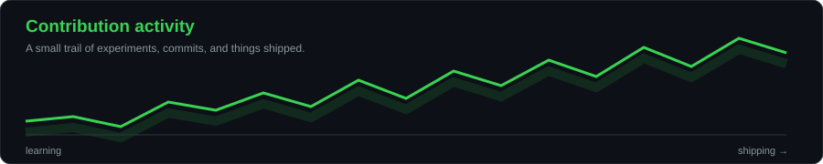
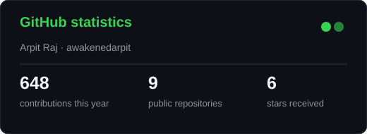
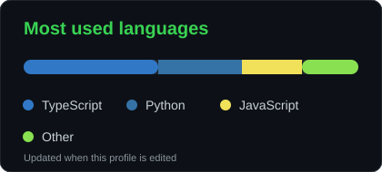

<div align="center">

<picture>
  
</picture>


<a href="https://github.com/awakenedarpit"></a>
<a href="https://github.com/awakenedarpit?tab=repositories"></a>
<!-- awakenedarpit-header-social-links -->
<a href="https://www.linkedin.com/in/awakenedarpit/"></a> <a href="mailto:awakenedarpit@gmail.com"></a> <a href="https://www.instagram.com/awakenedarpit/"></a> <a href="https://x.com/awakenedarpit"></a>


</div>

---

## `~/` whoami

```console
$ cat about.txt
```

Hi, I'm **Arpit Raj** — a **B.Tech AIML student** who likes turning ideas into practical software. I am learning by building, experimenting with interfaces, and exploring how AI/ML can make products more useful.

- Building projects across **AI/ML, web development, and creative software**
- Learning through hands-on implementation, iteration, and open-source tooling
- Interested in turning rough ideas into clean, usable experiences
- Always exploring the next concept worth building

## `~/` toolbox

<p align="center">
  
</p>

## `~/` selected work

<table>
<tr>
<td width="50%" valign="top">

### [Elvyn](https://github.com/awakenedarpit/Elvyn)

A connected student workspace for tasks, projects, goals, notes, resources, study planning, and focus sessions.

`Productivity` · `Student tools` · `Scalable foundation`

</td>
<td width="50%" valign="top">

### [COSMOS](https://github.com/awakenedarpit/COSMOS)

An experimental project space for exploring ideas, interfaces, and technical direction.

`Exploration` · `Experiments`

</td>
</tr>
<tr>
<td width="50%" valign="top">

### [VOX](https://github.com/awakenedarpit/VOX)

A project focused on voice-driven ideas and interaction experiments.

`Interaction` · `Voice`

</td>
<td width="50%" valign="top">

### [Quantum Flow](https://github.com/awakenedarpit/Quantum-Flow)

An experiment-driven repository for building, learning, and testing new concepts.

`Learning` · `Prototyping`

</td>
</tr>
</table>

## `~/` activity

<p align="center">
  
</p>

<p align="center">
  
  
</p>

---

<p align="center">
  <sub>Built with a dot-matrix portrait, a single green accent, and a bias toward shipping.</sub>
</p>

<!-- The portrait is regenerated from the public GitHub avatar by .github/workflows/portrait.yml. -->


<!-- awakenedarpit-credits-contact -->
## Contact & Credits

**Arpit Raj** ([@awakenedarpit](https://github.com/awakenedarpit)) is the creator and maintainer of this profile and its showcased projects.

For questions, ideas, or collaboration, connect through [GitHub](https://github.com/awakenedarpit) or browse the [public repositories](https://github.com/awakenedarpit?tab=repositories).

<!-- awakenedarpit-social-contact -->
### Connect with Arpit

- Instagram: [@awakenedarpit](https://www.instagram.com/awakenedarpit/)
- LinkedIn: [Arpit Raj](https://www.linkedin.com/in/awakenedarpit/)
- Email: [awakenedarpit@gmail.com](mailto:awakenedarpit@gmail.com)

<!-- awakenedarpit-twitter-contact -->
- Twitter/X: [@awakenedarpit](https://x.com/awakenedarpit)
